# PhotoApp

Приложение включает в себя аутентификацию пользователя и работу с фотографиями (для нормальной работы на симуляторе, просьба отключить AutoFill и Detect compromissed password).

Разделы README:

- [Structure](#structure)
- [Stack](#stack)
# Structure

Приложение состоит из нескольких модулей:

 
 - [LoginModule](#loginmodule)
 - [ProfileModule](#profilemodule)
 - [UsersModule](#usersmodule)
 - [PhotoModule](#photomodule)

Все экраны на модулях сверстаны с помощью NSLayoutAnchor. Основой для хранения данных является Core Data.

## LoginModule

Экран аутентификации пользователя. Основой данного экрана является UIViewController. 
Пользователю необходимо войти в свой профиль.

В случае, если пользователя нет в БД ему необходимо зарегестрироваться.

 

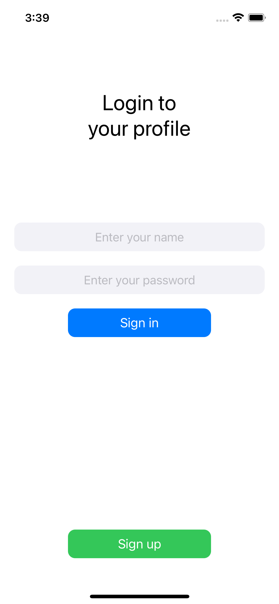
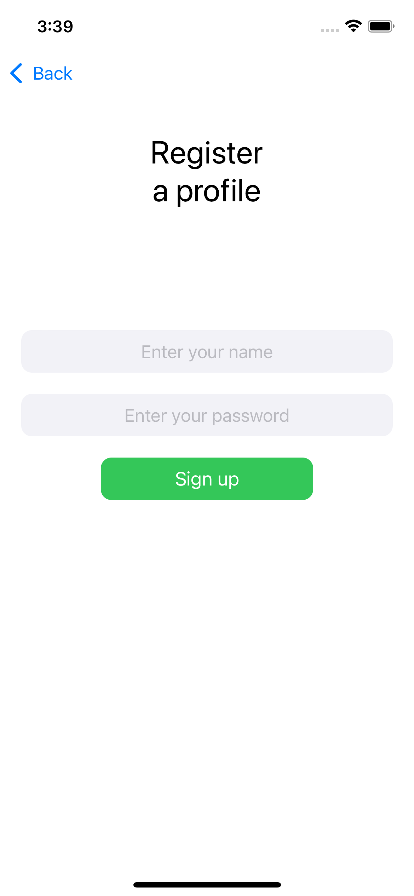
  

Если пользователь будет вводить имя которого нет в БД(картинка слева), если будет вводить имя которое уже занято(картинка справа)

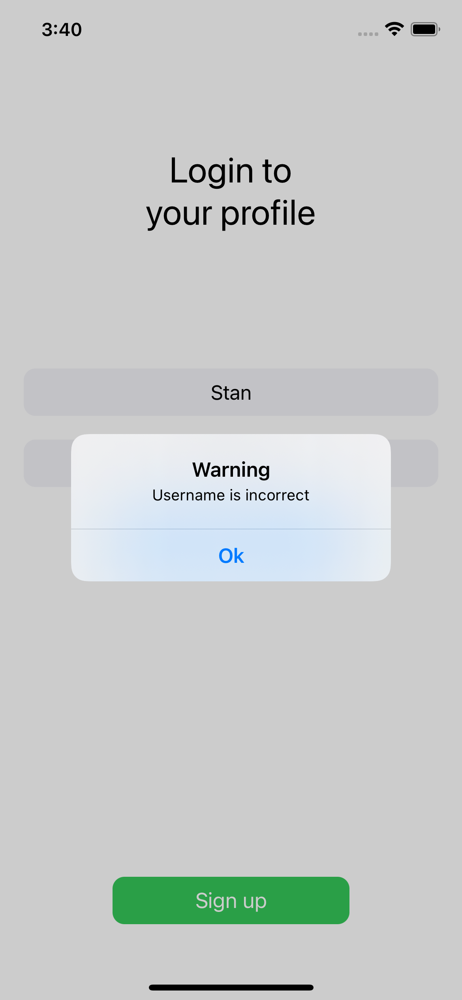
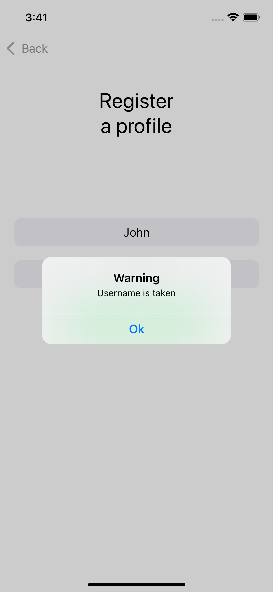

При успешной авторизации пользователь переходит в свой профиль.

## ProfileModule

Модуль работает на основе UITabBarController & UIViewController. Экран показывает имя пользователя и его аватар.

 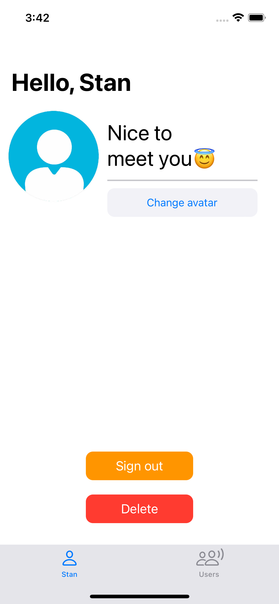

Пользователь может выйти из своего аккаунта(разлогиниться) или удалить его(что повлечет за собой удаление из БД). При выходе из аккаунта все измененные данные сохраняются.

При регистрации профиля пользователю предоставляется стандартный аватар. Пользователь может изменить свой аватар, нажав на соответствующую кнопку(переход на PhotoModule).

## UsersModule

Модуль работает на основе UITabBarController & UITableViewController. Экран содержит имена и аватары всех зарегистрированных пользователей, включая текущего авторизованного пользователя. Если пользователь удаляет свой профиль, он удаляется с данного экрана.

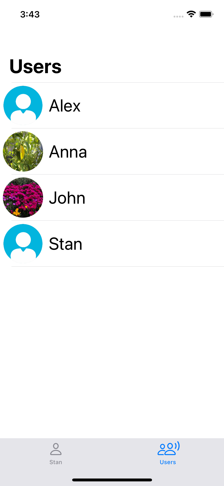
 
## PhotoModule

В данном модуле выполняется работа с локальными фотографиями и альбомами, которые интегрированы на кастомный экран. Модуль состоит из нескольких экранов:

- [Photo](#photo)
- [Albums](#albums)
- [CurrentPhoto](#currentphoto)

### Photo

Основой экрана являются UIViewController & CollectionView. Экран показывает локальные фотографии выбранного альбома.

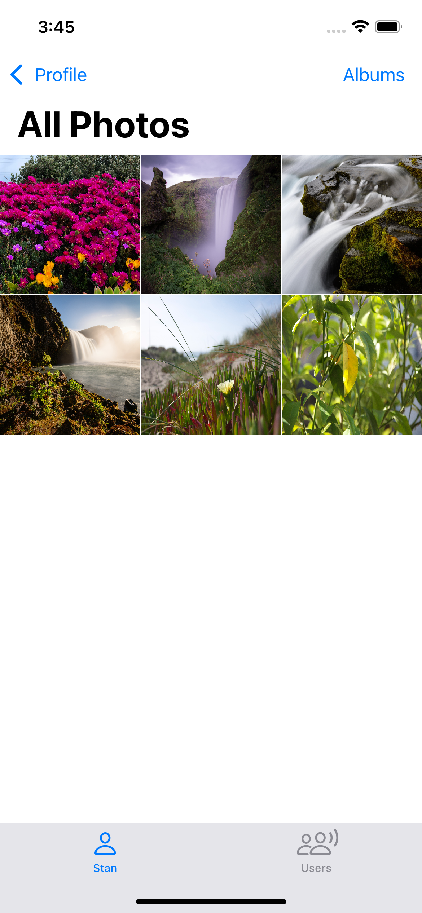

Пользователь может изменить выбранный альбом нажав на соответствующую кнопку(переход на Albums). Если пользователь нажимает на любую фотографию то переходит на экран с выбранной фотографией(переход на CurrentPhoto).

### Albums

Основой экрана является UITableViewController. Экран содержит все локальные альбомы фотографий пользователя.

На данном экране пользователь выбирает альбом, фотографии которого будут изображены на предыдущем экране(Photo).

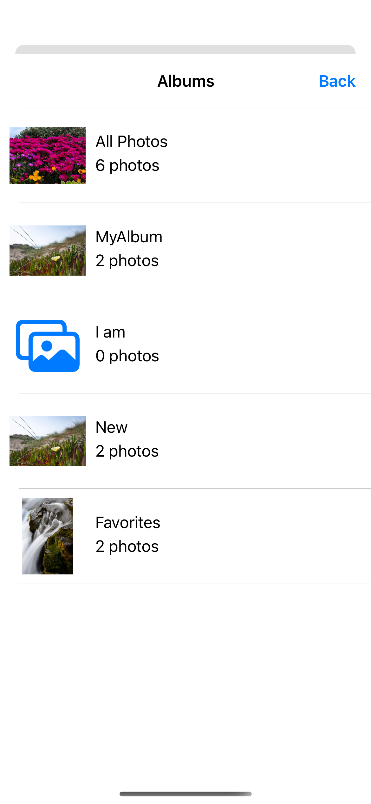
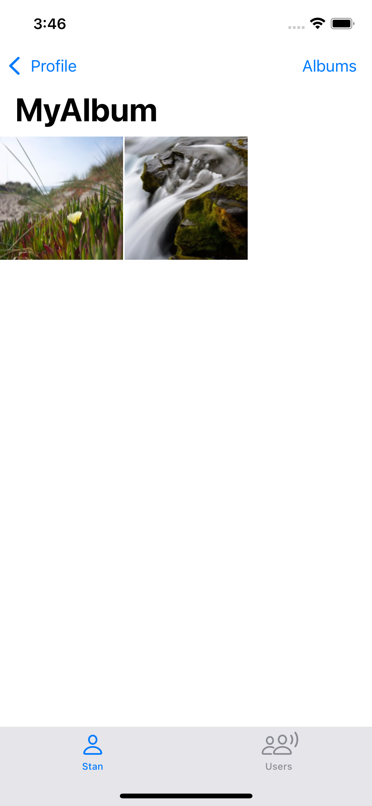
  
### CurrentPhoto

Основой экрана является UIViewController. Экран показывет выбранную пользователем фотографию.

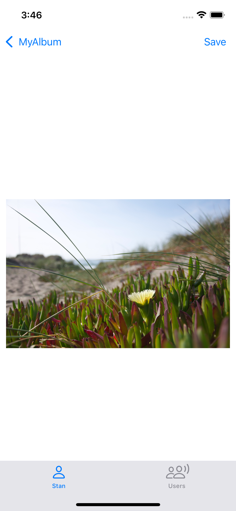

Пользователь может изменить аватар своего профиля на данную фотографию, нажав на кнопку Save, после чего внесутся изменения в БД.

 

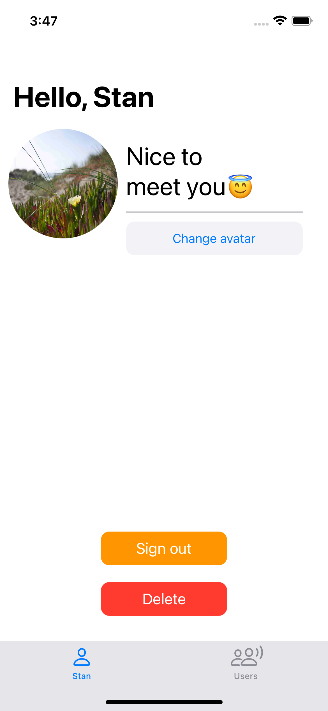
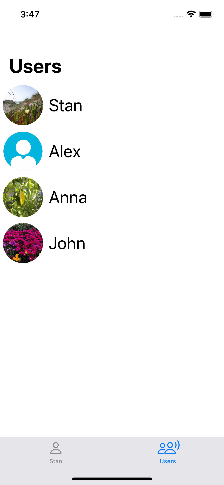

# Stack
- Core Data
- UITabBarController & UINavigationController
- UIViewController & UIView(Label, Button и т.д) & Alert
- UICollectionView & UICollectionViewCell
- UITableViewController & UITableViewCell
- Photos & PhotosUI

